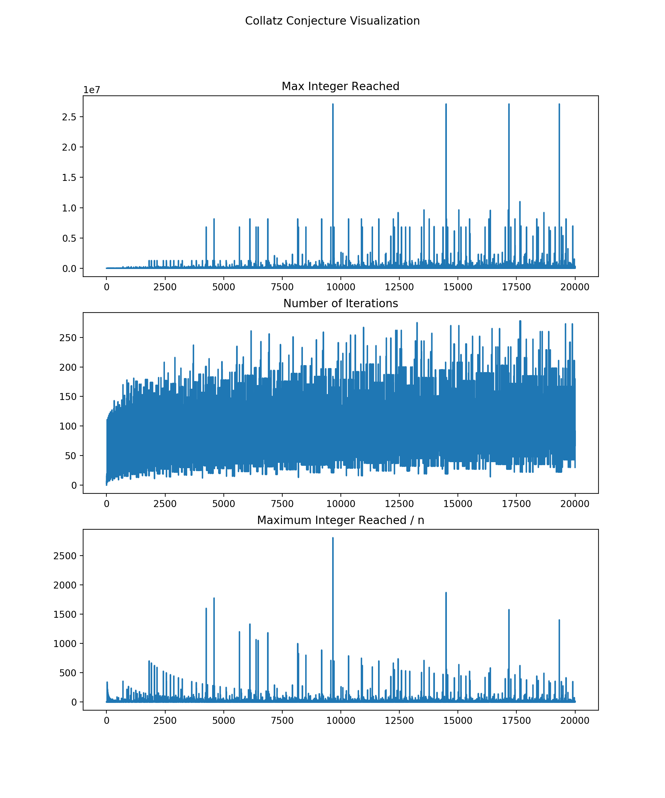

# Collatz Conjecture

## Problem

The **Collatz Conjecture** is a conjecture in mathematics that conerns a sequence defined as follows: start with any positive integer $n$. Then each term is obtained from the previous term as follows: if the previous term is even, the next term is one half of the previous term. If the previous term is odd, the next term is 3 times the previous term plus 1. The conjecture is that no matter what value of $n$, the sequence will always reach 1.

*From Wikipedia*

In other words, given any positive integer $n$, we have such sequence of integers where the first element is $n$, and every other element equals the previous element transformed by $f$ where

$$f(n) = \begin{cases}n / 2 & \text{ if $n$ is even } \\ 3n + 1 & \text{ if $n$ is odd }\end{cases}$$

And the Collatz Conjecture states that this sequence would always reach 1.

## Example

7 => 22 => 11 => 34 => 17 => 52 => 26 => 13 => 40 => 20 => 10 => 5 => 16 => 8 => 4 => 2 => 1

## Visualizations

## Reference

[The 3x+1 Problem: An Annotated Bibliography (1963 - 1999) *by Jeffery C. Lagarias*](https://arxiv.org/pdf/math/0309224.pdf)

## Not-A-Proof
